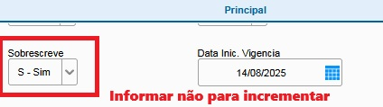

Facilitando a Regra de NCM
[Video](https://www.youtube.com/watch?v=AF7RCnF2Y5o&t=1s)

- Atualizações:
    -  10/08/2025 -> Quando der erro ou falha na validação, na geração do NCM, aborta a operação, não interando com toda lista de NCMs, evitando ver a janela de mensagem de erro para cada NCM.
    -  14/08/2025 -> Antes, só era possível sobrescrever. Agora, é possível incrementar as abas de Alíquota e MVA para o imposto selecionado na aba Tributos. O padrão é sobrescrever, mas pode ser configurado para não sobrescrever, ou seja incrementar.
        